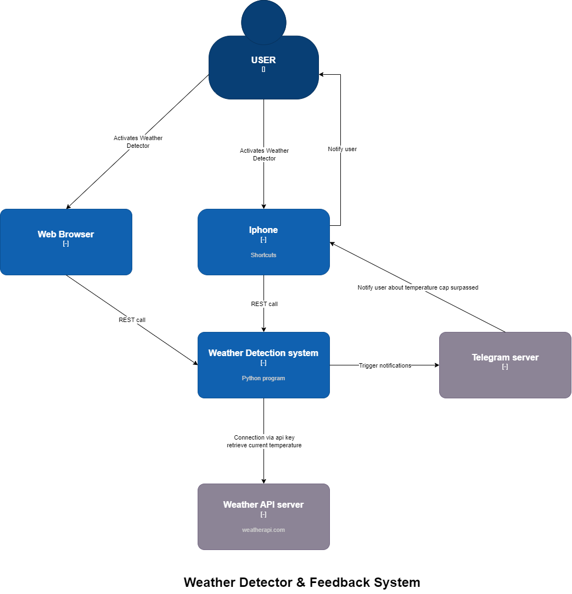

# Weather Detector

## Description

- **Product**:
      - **Develop a monitoring tool that:**
          - Runs on the Render Web Service
          - Detector can be started via Iphone shortcut
          - Regularly checks live temperature via API key
          - Notifies if temperature exceeds the given the max temperature, in the current version: 10 Celcius
          - The API key is hidden in a enivromental variable
      - **Telegram notification system**
          - Uses the telegram bot system aquire chat ID
          - With the chat ID, once the program detects the max temperature is passed a message is sent to user

## User guide

- Requirements: Server activated, access to /start and /stop link
- If the server needs to be enabled, go to Render and either deploy latest commit or restart service
- To execute, either use the Iphone shortcut, or go to the /start link to activate, and /stop link to deactivate
